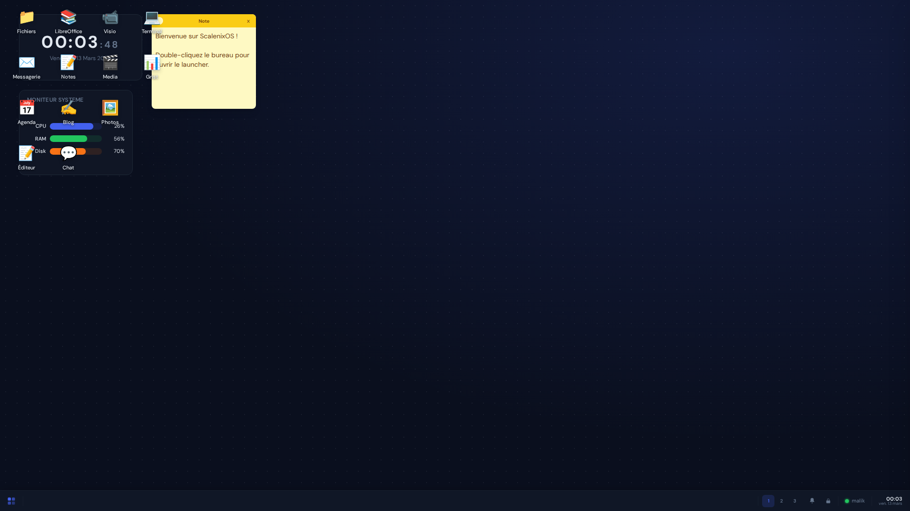
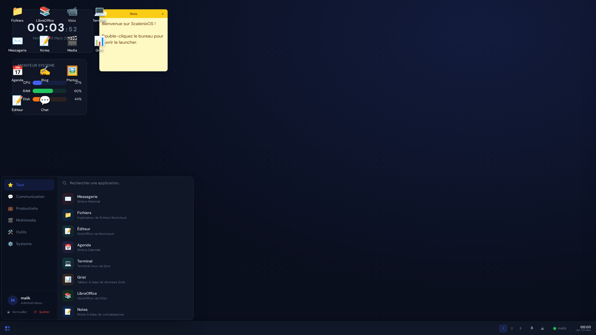
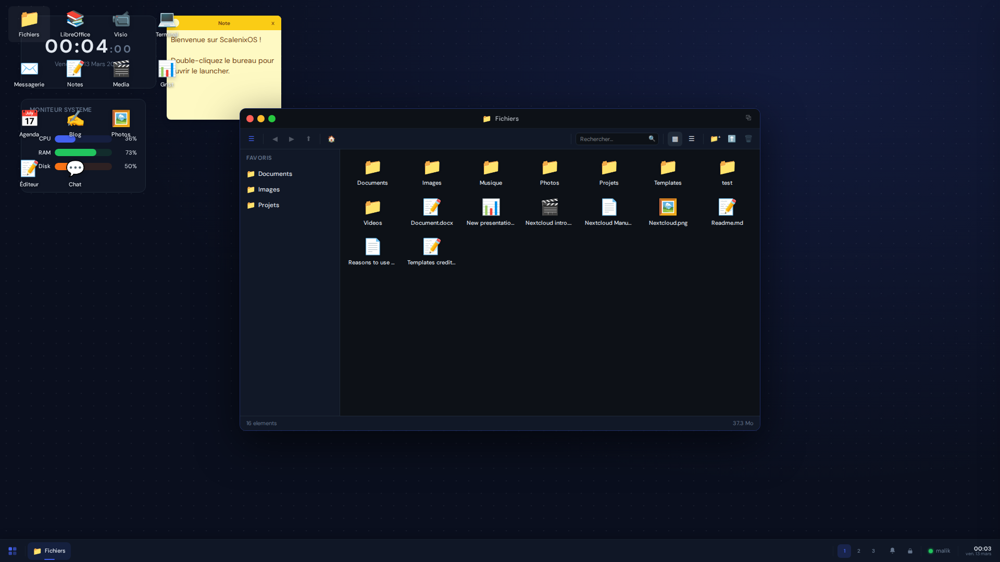
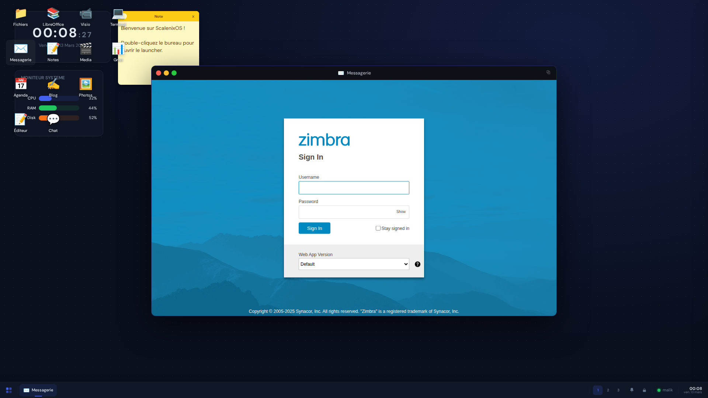
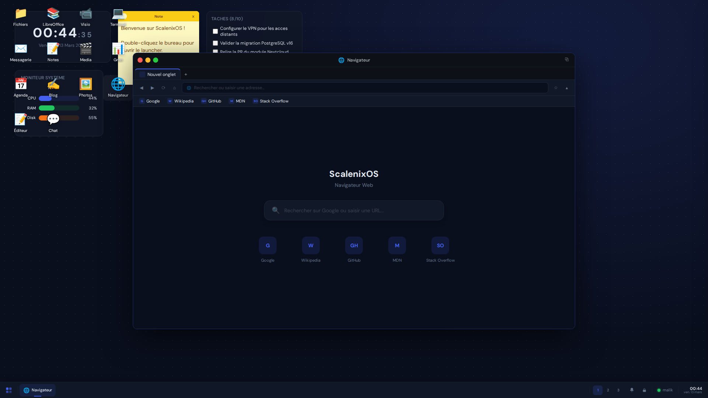
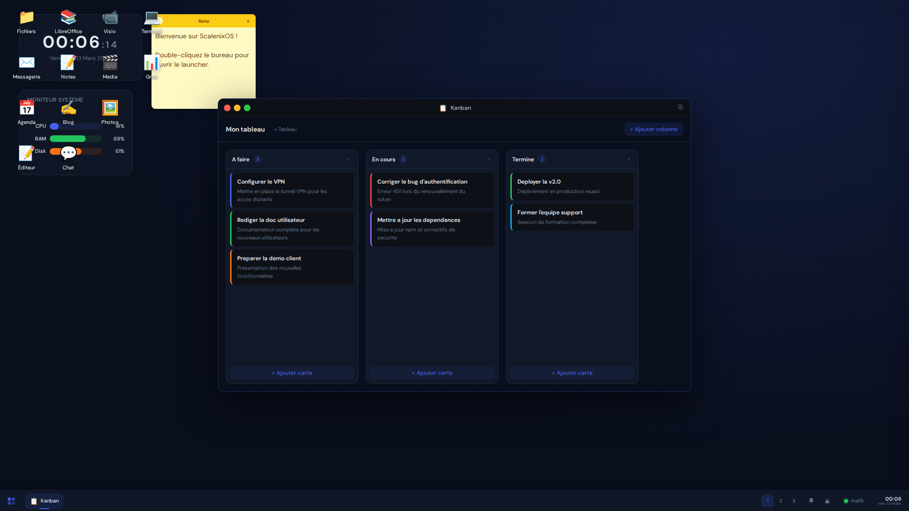
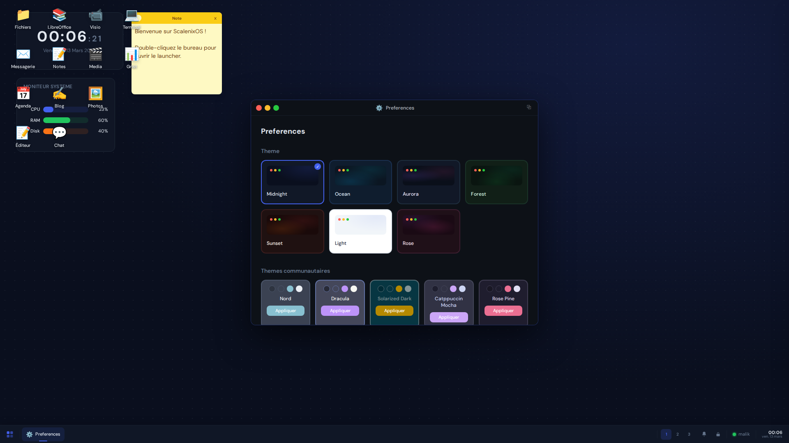
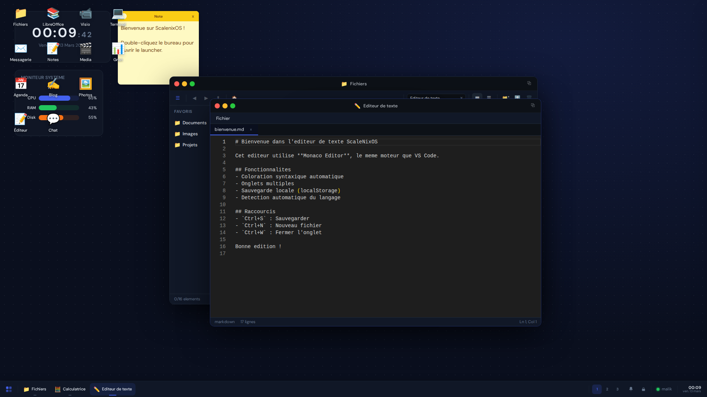

<p align="center">
  <a href="https://github.com/ScaleNix/ScaleNixOS/raw/main/docs/landing/video/demo.mp4">
    
    <br />
    <strong>▶ Click to watch the full demo video</strong>
  </a>
</p>

<h1 align="center">ScaleNix OS</h1>

<p align="center">
  <strong>A full-featured web desktop environment accessible from any browser.</strong>
  <br />
  30+ integrated apps &bull; 5 languages &bull; Single Sign-On &bull; Self-Hosted
</p>

<p align="center">
  <a href="LICENSE"></a>
  
  
  
  
  
  
  
</p>

<p align="center">
  <a href="#-quick-start">Quick Start</a> &bull;
  <a href="docs/DEVELOPER.md">Developer Guide</a> &bull;
  <a href="docs/ADMIN.md">Admin Guide</a> &bull;
  <a href="docs/USER.md">User Guide</a> &bull;
  <a href="CONTRIBUTING.md">Contributing</a>
</p>

---

## What is ScaleNix OS?

ScaleNix OS is a **cloud desktop** that runs entirely in the browser. It provides a familiar desktop experience &mdash; draggable windows, taskbar, app launcher, notifications, widgets &mdash; while integrating **30+ enterprise applications** behind a unified single sign-on.

Think of it as your organization's private workspace: email, files, chat, video calls, documents, passwords, code editor, and more &mdash; all accessible from a single browser tab, from anywhere.

---

## Screenshots

<table>
  <tr>
    <td align="center"><strong>Desktop</strong><br /></td>
    <td align="center"><strong>App Launcher</strong><br /></td>
  </tr>
  <tr>
    <td align="center"><strong>File Explorer</strong><br /></td>
    <td align="center"><strong>Email (Zimbra)</strong><br /></td>
  </tr>
  <tr>
    <td align="center"><strong>Browser</strong><br /></td>
    <td align="center"><strong>Kanban Board</strong><br /></td>
  </tr>
  <tr>
    <td align="center"><strong>Settings</strong><br /></td>
    <td align="center"><strong>Multi-Window</strong><br /></td>
  </tr>
</table>

---

## Key Features

| Feature | Description |
|---------|-------------|
| **Window Manager** | Drag, resize, snap (left/right/maximize), minimize, Alt+Tab, Picture-in-Picture |
| **30+ Applications** | Email, files, chat, video, documents, code, passwords, and more |
| **Single Sign-On** | Keycloak OIDC (Authorization Code + PKCE), role-based access control |
| **5 Languages** | French, English, Italian, Spanish, German &mdash; switchable instantly |
| **15 Desktop Widgets** | Clock, calendar, notes, weather, mail preview, chat, system monitor |
| **Spotlight Search** | Ctrl+K to instantly find and launch any app |
| **Desktop Personalization** | Dark/light/auto themes, custom wallpapers, accent colors |
| **Onboarding Wizard** | Guided first-launch experience for new users |
| **Session Persistence** | Window positions and app state saved across sessions |
| **Keyboard Shortcuts** | Fully customizable global shortcuts |
| **35+ E2E Tests** | Playwright test suite for reliability |

---

## Tech Stack

<table>
  <tr>
    <th>Layer</th>
    <th>Technology</th>
  </tr>
  <tr><td><strong>Frontend</strong></td><td>React 18 &bull; Vite &bull; TypeScript &bull; Tailwind CSS v4</td></tr>
  <tr><td><strong>State</strong></td><td>Zustand (15+ stores with persistence)</td></tr>
  <tr><td><strong>Auth</strong></td><td>Keycloak 24 (OIDC PKCE via keycloak-js)</td></tr>
  <tr><td><strong>Proxy</strong></td><td>Traefik v3 (TLS termination, routing)</td></tr>
  <tr><td><strong>Infra</strong></td><td>Docker &bull; Docker Compose</td></tr>
  <tr><td><strong>Email</strong></td><td>Zimbra 10 (preauth SSO)</td></tr>
  <tr><td><strong>Files</strong></td><td>Nextcloud 29 (WebDAV + OIDC)</td></tr>
  <tr><td><strong>Office</strong></td><td>OnlyOffice 8 (via Nextcloud)</td></tr>
  <tr><td><strong>Chat</strong></td><td>Matrix / Synapse + Element Web</td></tr>
  <tr><td><strong>Video</strong></td><td>LiveKit (WebRTC SFU)</td></tr>
  <tr><td><strong>Spreadsheets</strong></td><td>Grist</td></tr>
  <tr><td><strong>Wiki</strong></td><td>Outline</td></tr>
  <tr><td><strong>Blog</strong></td><td>Ghost</td></tr>
  <tr><td><strong>Photos</strong></td><td>Immich (with ML)</td></tr>
  <tr><td><strong>Passwords</strong></td><td>Vaultwarden (Bitwarden-compatible)</td></tr>
  <tr><td><strong>Code Editor</strong></td><td>code-server (VS Code)</td></tr>
  <tr><td><strong>Whiteboard</strong></td><td>Excalidraw</td></tr>
  <tr><td><strong>Media</strong></td><td>Jellyfin</td></tr>
  <tr><td><strong>Linux Apps</strong></td><td>Xpra HTML5</td></tr>
  <tr><td><strong>Testing</strong></td><td>Playwright (35+ E2E tests)</td></tr>
</table>

---

## Application Catalog

<details>
<summary><strong>Communication</strong> (5 apps)</summary>

| App | Type | Description |
|-----|------|-------------|
| Messagerie | iframe | Zimbra Webmail with preauth SSO |
| Agenda | iframe | Zimbra Calendar |
| Chat | iframe | Matrix/Element instant messaging |
| Visio | iframe | LiveKit video conferencing (WebRTC) |
| Annuaire | native | Employee directory from Keycloak |

</details>

<details>
<summary><strong>Productivity</strong> (7 apps)</summary>

| App | Type | Description |
|-----|------|-------------|
| Fichiers | native | Nextcloud File Explorer with WebDAV |
| Editeur | iframe | OnlyOffice (Word, Excel, PowerPoint) |
| Grist | iframe | Spreadsheets & databases |
| Notes | iframe | Outline knowledge base / wiki |
| Blog | iframe | Ghost publishing platform |
| Kanban | native | Task boards with drag & drop |
| Tableau blanc | iframe | Excalidraw collaborative whiteboard |

</details>

<details>
<summary><strong>Tools</strong> (10 apps)</summary>

| App | Type | Description |
|-----|------|-------------|
| Terminal | xpra | Linux terminal via Xpra |
| Code | iframe | VS Code in browser (code-server) |
| Navigateur | iframe | Chromium via Selkies-GStreamer |
| Calculatrice | native | Scientific calculator |
| Horloge mondiale | native | World timezone clock |
| Editeur de texte | native | Text editor with syntax highlighting |
| Capture d'ecran | native | Screenshot & screen recording |
| Presse-papiers | native | Clipboard history (Ctrl+Shift+V) |
| Audio | native | Volume mixer & notification sounds |
| Mots de passe | iframe | Vaultwarden password manager |

</details>

<details>
<summary><strong>Multimedia</strong> (2 apps)</summary>

| App | Type | Description |
|-----|------|-------------|
| Media | iframe | Jellyfin media player |
| Photos | iframe | Immich photo management with AI search |

</details>

<details>
<summary><strong>System</strong> (7 apps)</summary>

| App | Type | Description |
|-----|------|-------------|
| Preferences | native | Theme, wallpaper, language, shortcuts |
| App Store | native | Enable/disable/pin applications |
| Gestionnaire de taches | native | Process & window manager |
| Widgets | native | Desktop widget manager |
| Corbeille | native | Nextcloud trash / deleted files |
| Mon Profil | native | User profile & preferences |
| Admin IAM | iframe | Keycloak admin console (admin only) |

</details>

---

## Quick Start

### Development (frontend only)

```bash
git clone https://github.com/ScaleNix/ScaleNixOS.git
cd ScaleNixOS/shell
cp .env.example .env       # Configure service URLs
npm install
npm run dev                # Starts at http://localhost:3000
```

### Full Stack (Docker Compose)

```bash
cd ScaleNixOS/infra
cp .env.example .env       # Configure ALL secrets
docker compose up -d --build
```

> **Detailed instructions:** [Admin Guide](docs/ADMIN.md) &bull; [Developer Guide](docs/DEVELOPER.md)

---

## Project Structure

```
ScaleNixOS/
├── shell/                     # React frontend
│   ├── src/
│   │   ├── apps/             # 30+ app components
│   │   ├── desktop/          # Desktop shell (Taskbar, Launcher, Spotlight)
│   │   │   └── widgets/      # 15 desktop widgets
│   │   ├── windows/          # Window manager
│   │   ├── store/            # 15+ Zustand stores
│   │   ├── i18n/             # 5 languages, 560+ keys each
│   │   ├── auth/             # Keycloak OIDC
│   │   ├── api/              # Matrix, Grist, Zimbra, WebDAV clients
│   │   └── hooks/            # Custom React hooks
│   ├── public/apps/          # App registry (runtime config)
│   └── e2e/                  # 35+ Playwright E2E tests
├── infra/                     # Docker infrastructure
│   ├── docker-compose.yml    # 20+ services
│   ├── keycloak/             # Realm config + login theme
│   ├── traefik/              # Reverse proxy + TLS
│   ├── matrix/               # Synapse + Element config
│   ├── livekit/              # LiveKit server + Meet UI
│   └── docker/               # Custom Dockerfiles
├── docs/                      # Documentation
│   ├── DEVELOPER.md          # Developer guide
│   ├── ADMIN.md              # Admin / deployment guide
│   └── USER.md               # End-user guide
├── CONTRIBUTING.md            # How to contribute
└── LICENSE                    # LGPL-2.0
```

---

## Documentation

| Guide | Description |
|-------|-------------|
| **[Developer Guide](docs/DEVELOPER.md)** | Architecture, adding apps & widgets, i18n, state management, testing |
| **[Admin Guide](docs/ADMIN.md)** | Deployment, service configuration, Keycloak, TLS, backups, troubleshooting |
| **[User Guide](docs/USER.md)** | Desktop usage, app descriptions, keyboard shortcuts, personalization |
| **[Contributing](CONTRIBUTING.md)** | How to contribute, code style, PR process |

---

## Contributing

We welcome contributions! Whether it's bug fixes, new features, documentation, or translations &mdash; every contribution matters.

See **[CONTRIBUTING.md](CONTRIBUTING.md)** for the full guide, or jump straight in:

```bash
# Fork & clone
git clone https://github.com/YOUR_USERNAME/ScaleNixOS.git
cd ScaleNixOS/shell
npm install && npm run dev

# Make your changes, then
npx playwright test          # Run tests
git commit -m "feat: description"
# Open a Pull Request
```

---

## License

This project is licensed under the **GNU Library General Public License v2 (LGPL-2.0)**.
See [LICENSE](LICENSE) for the full text.

---

<p align="center">
  Built by <a href="https://scalenix.fr"><strong>Scalenix</strong></a> &mdash; Founded by Malik Benmekki
  <br /><br />
  <sub>If you find this project useful, please consider giving it a star!</sub>
</p>
